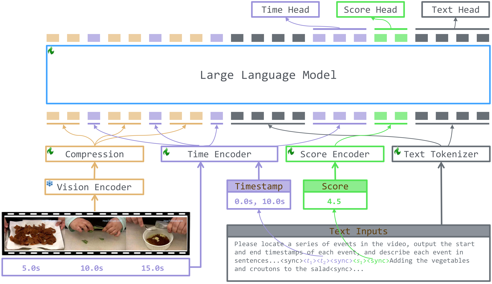
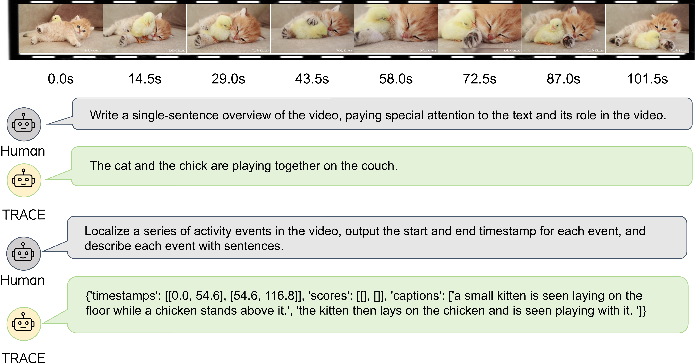

<h2 align="center"> <a href="https://arxiv.org/abs/2410.05643">TRACE: Temporal Grounding Video LLM via Casual Event Modeling</a></h2>

<h5 align="center"> If our project helps you, please give us a star ⭐ and cite our <a href="#bibliography">paper</a>!</h2>
<h5 align="center">

[](https://huggingface.co/papers/2410.05643)
[](https://huggingface.co/Yongxin-Guo/trace-uni)
[](https://huggingface.co/datasets/Yongxin-Guo/TRACE)
[](https://arxiv.org/abs/2410.05643)
[](https://hits.seeyoufarm.com)


## News

- 01/11/2024, 🔥We are excited to announce the release of [trace-uni](https://huggingface.co/Yongxin-Guo/trace-uni), which has been enhanced by incorporating additional general video understanding data from a subset of [LLaVA-Video-178k](https://huggingface.co/datasets/lmms-lab/LLaVA-Video-178K). Our results indicate that (1) the TRACE architecture is still capable of handling general video understanding tasks (53.8 on MVBench and 49.6 on VideoMME); (2) *although not adding more VTG data*, trace-uni outperforms trace in *both VTG tasks and general video understanding tasks*. 
- 31/10/2024, 🔥 We evaluated the TRACE nodel on [VideoMME](https://video-mme.github.io/home_page.html) benchmark and updated the evaluation code.
- 25/10/2024, 🔥 We evaluated the TRACE model on the [MVBench](https://github.com/OpenGVLab/Ask-Anything) benchmark and updated the evaluation code accordingly. Our findings indicate that, *despite not being trained on extensive multi-task datasets*, TRACE is still capable of effectively handling general QA tasks.
- 19/10/2024, 🔥 We release [trace-retrieval](https://huggingface.co/Yongxin-Guo/trace-retrieval) by forcing the predicted timestamps to be align with the input frame timestamps. Results show trace-retrieval achieve better performance on dense video captioning tasks
- 10/10/2024, 🔥 Annotation files of training data are released!
- 10/10/2024, 🔥 Our model checkpoints and code are released!

TODO

- [x] Release the model checkpoints
- [x] Release the inference and evaluation code
- [x] Release the training and fine-tuning code
- [x] Release the training data
- [x] Release the TRACE-Retrieval, which outputs timestamps of input frames instead of predict unseen timestamps.
- [x] Train TRACE models on more tasks.

## Overview

In this work
- We model the videos by a series of events, and propose causal event modeling framework to capture videos' inherent structure.
- We present a novel task-interleaved video LLM model, TRACE, tailored to implement the causal event modeling framework through the sequential encoding/decoding of timestamps, salient scores, and textual captions.

<div align="center">
    
    <br/>
    <figcaption>Overview of TRACE.</figcaption>
</div>

## Enviroments

We use NPU environments for training and fine-tuning, and use V100 GPUs for evaluation. The environment we use can be found in [npu-requirements](./install_requirements-npu.sh) and [gpu-requirements](./requirements.txt).

## Model Zoo

| Checkpoints | Description | URL |
| ----------- | ----------- | ----------- |
| Initialization      | Weights initialized from VideoLLaMA2 | [trace-init](https://huggingface.co/Yongxin-Guo/trace-init) |
| Stage-1      | Model checkpoints trained after stage-1 | [trace-stage1](https://huggingface.co/Yongxin-Guo/trace-stage1) |
| Stage-2   | Model checkpoints trained after stage-2 | [trace](https://huggingface.co/Yongxin-Guo/trace) |
| FT-Charades      | Fine-tuned on Charades-STA dataset | [trace-ft-charades](https://huggingface.co/Yongxin-Guo/trace-ft-charades) |
| FT-Youcook2      | Fine-tuned on Youcook2 dataset | [trace-ft-youcook2](https://huggingface.co/Yongxin-Guo/trace-ft-youcook2) |
| FT-QVHighlights   | Fine-tuned on QVHighlights dataset | [trace-ft-qvhighlights](https://huggingface.co/Yongxin-Guo/trace-ft-qvhighlights) |
| TRACE-retrieval   | Forcing the predicted timestamps to be align with input timestamps | [trace-retrieval](https://huggingface.co/Yongxin-Guo/trace-retrieval) |
| TRACE-uni | Incorporating additional general video understanding data from a subset of [LLaVA-Video-178k](https://huggingface.co/datasets/lmms-lab/LLaVA-Video-178K). | [trace-uni](https://huggingface.co/Yongxin-Guo/trace-uni) |

## Inference and Evaluation

Please make sure the model and video paths are correct before running the code.
- Inference codes are provided in [inference.py](./scripts/inference/inference.py).
- Evaluation codes are provided in [trace/eval](./trace/eval/)

## Data

We have provided the [annotation files](https://huggingface.co/datasets/Yongxin-Guo/TRACE), and the raw videos can be prepared by the following projects
- [VTG-IT](https://github.com/gyxxyg/VTG-LLM)
- [Video-LLaVA](https://github.com/PKU-YuanGroup/Video-LLaVA)
- [ShareGPT4Video](https://huggingface.co/datasets/ShareGPT4Video/ShareGPT4Video)
- [Next-QA](https://github.com/doc-doc/NExT-QA)
- [TextVR](https://github.com/callsys/TextVR)
- [InternVid](https://huggingface.co/datasets/OpenGVLab/InternVid-Full)

## Training

Stage 1 training

```
bash TRACE/scripts/train/pretrain-128.sh
```

Stage 2 training

```
bash TRACE/scripts/train/sft-128.sh
```

Fine-tune on downsteam task

```
bash TRACE/scripts/train/sft-youcook2.sh
```

Please config the data and model paths before running the scrips.

## Results

| Youcook2 (Zero-Shot) | CIDER | METEOR | SODA_c | F1 |
| --- | --- | --- | --- | --- |
| TRACE | 8.1 | 2.8 | 2.2 | 22.4 |
| TRACE-retrieal | 8.3 | 2.9 | 2.3 | 24.1 |
| TRACE-uni | 8.6 | 2.9 | 2.3 | 22.4 |

| Charades-STA (Zero-Shot) | 0.3 | 0.5 | 0.7 | mIOU |
| --- | --- | --- | --- | --- |
| TRACE | 58.6 | 40.3 | 19.4 | 38.7 |
| TRACE-retrieval | 57.9 | 37.4 | 17.3 | 37.4 |
| TRACE-uni | 63.7 | 43.7 | 21.0 | 41.5 |

| QVHighlights (Zero-Shot) | mAP | Hit@1 |
| --- | --- | --- |
| TRACE | 26.8 | 42.7 |
| TRACE-retrieval | 27.9 | 44.3 |
| TRACE-uni | 27.5 | 43.9 |


| ActivityNet-DVC | CIDER | METEOR | SODA_c | F1 |
| --- | --- | --- | --- | --- |
| TRACE | 25.9 | 6.0 | 6.4 | 39.3 |
| TRACE-retrieval | 25.7 | 5.9 | 6.5 | 40.1 |
| TRACE-uni | 29.2 | 6.9 | 6.4 | 40.4 |

| ActivityNet-MR | 0.3 | 0.5 | 0.7 | mIOU |
| --- | --- | --- | --- | --- |
| TRACE | 54.0 | 37.7 | 24.0 | 39.0 |
| TRACE-retrieval | 54.4 | 39.8 | 24.9 | 40.2 |
| TRACE-uni | 53.2 | 38.2 | 24.7 | 39.4 |

| MVBench | Avg | AS | AP | AA | FA | UA | OE | OI | OS | MD | AL | ST | AC | MC | MA | SC | FP | CO | EN | ER | CI |
| --- | --- | --- | --- | --- | --- | --- | --- | --- | --- | --- | --- | --- | --- | --- | --- | --- | --- | --- | --- | --- | --- |
| TRACE | 48.1 | 61.2 | 56.5 | 72.5 | 46.5 | 61.0 | 48.0 | 69.5 | 40.0 | 22.0 | 31.0 | 86.5 | 37.5 | 37.0 | 51.0 | 45.0 | 40.5 | 39.0 | 31.0 | 43.5 | 44.5 |
| TRACE-uni | 53.8 | 68.1 | 58.5 | 72.5 | 41.5 | 73.5 | 55.1 | 71.5 | 40.5 | 25.0 | 53.0 | 88.5 | 63.5 | 38.5 | 51.0 | 52.5 | 49.0 | 59.5 | 33.5 | 49.5 | 32.5 |


| VideoMME (w/o subtitle) | Short | Midium | Long | Avg |
| --- | --- | --- | --- | --- |
| TRACE | 49.5 | 42.5 | 39.3 | 43.8 |
| TRACE-uni | 58.2 | 48.1 | 42.3 | 49.6 |

## Demo

<div align="center">
    
    <br/>
    <figcaption>Demo of TRACE.</figcaption>
</div>


## AcknowledgementWe are grateful for the following awesome projects:
* [VideoLLaMA2](https://github.com/DAMO-NLP-SG/VideoLLaMA2)
* [VTG-LLM](https://github.com/gyxxyg/VTG-LLM)
* [TimeChat](https://github.com/RenShuhuai-Andy/TimeChat)
* [Ask-Anything](https://github.com/OpenGVLab/Ask-Anything)
* [InternVid](https://github.com/OpenGVLab/InternVideo/tree/main/Data/InternVid)


## Bibliography
If you find this repository helpful for your project, please consider citing:
```
@misc{guo2024tracetemporalgroundingvideo,
      title={TRACE: Temporal Grounding Video LLM via Causal Event Modeling}, 
      author={Yongxin Guo and Jingyu Liu and Mingda Li and Xiaoying Tang and Qingbin Liu and Xi Chen},
      year={2024},
      eprint={2410.05643},
      archivePrefix={arXiv},
      primaryClass={cs.CV},
      url={https://arxiv.org/abs/2410.05643}, 
}
```
